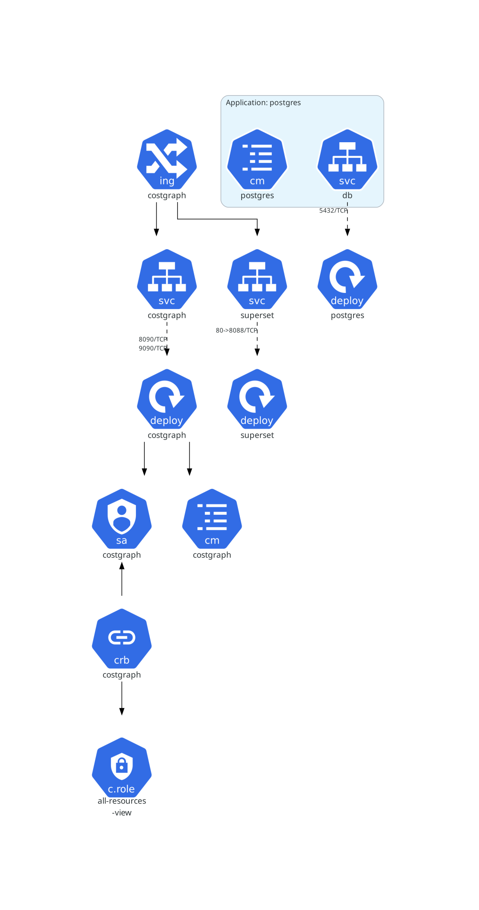

# costgraph-charts
Helm chart definitions to deploy costgraph to the clusters.


# Generating diagrams
```bash
pip install KubeDiagrams
helm-diagrams ./charts/costgraph
mv local-costgraph.png ./images/diagram.png
```
This will generate a diagram of the costgraph operator and its dependencies. The diagram will be saved in the `images` directory as `diagram.png`.


## Testing
Create a new values file that contains the configuration you'd like to deploy

```bash
cd charts/<chart-name>
helm template . -f <your-values-file> | tee | kubectl apply --dry-run=client -f -
```